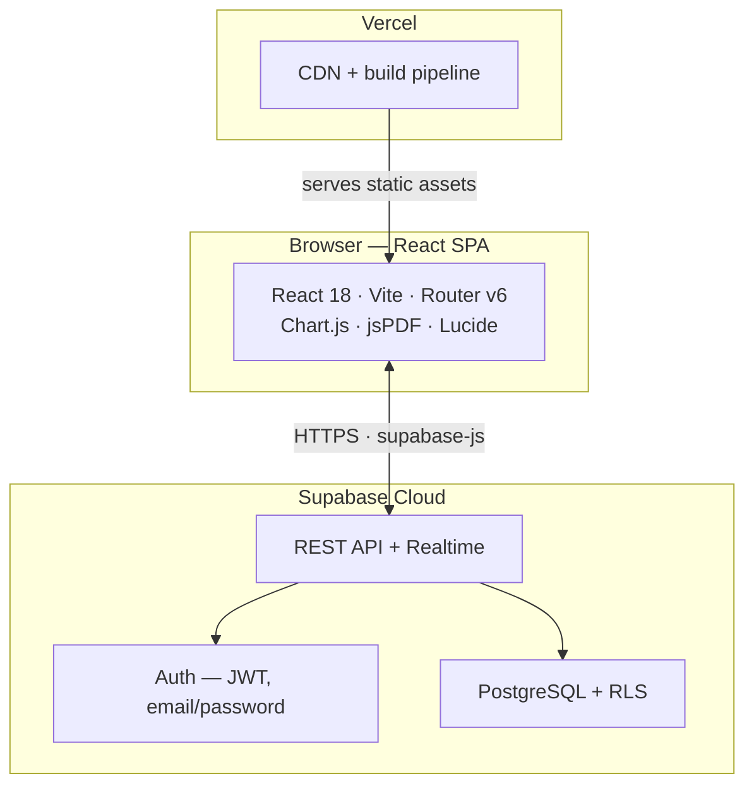
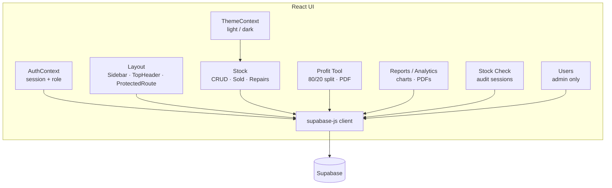
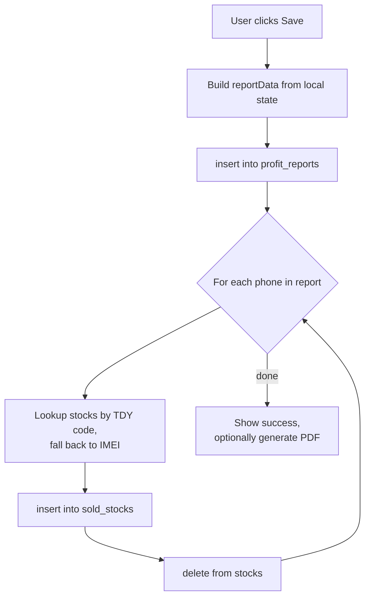
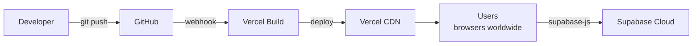

# High‑Level Design (HLD)

**Project:** Teddy Mobile — Stock Management System
**Version:** 1.0
**Last updated:** 2026‑05‑19

---

## 1. Purpose & Scope

The Teddy Mobile Stock Management System is an internal web application that digitises the day‑to‑day operations of a mobile phone retail store. It replaces ad‑hoc spreadsheets and paper records with a single source of truth for:

- Inventory (in‑stock, sold, in‑repair)
- Daily profit calculation and partner profit splits
- Partner payment tracking
- Physical stock audits
- Role‑based access for admins and cashiers

The system is browser‑based, mobile‑friendly, and used by a small team (≤ 10 concurrent users).

---

## 2. Goals & Non‑Goals

### Goals
- Provide a fast, reliable single‑page web app that works on desktop and mobile.
- Persist all business data in a managed, secure Postgres database (Supabase).
- Enforce role‑based access (admin vs cashier) for sensitive operations.
- Generate professional PDF reports for daily profit, audits, and partner statements.
- Be cheap to host (free / hobby tier of Vercel + Supabase is sufficient for the use case).

### Non‑Goals
- This release does **not** implement multi‑tenant / multi‑store support.
- No public/customer‑facing storefront.
- No real‑time multi‑user collaboration (no live editing locks).
- No offline mode.

---

## 3. System Architecture

- **Front end** is a static SPA built by Vite and served from Vercel's CDN.
- **Back end** is entirely Supabase: it provides authentication, database, and an auto‑generated REST API consumed via `@supabase/supabase-js`.
- There is **no custom server** — all business logic that needs to be enforced server‑side is implemented in PostgreSQL via Row‑Level Security (RLS) policies and `auth.uid()` checks.

---

## 4. Logical Module View

### Modules

| Module           | Responsibility                                                                 |
| ---------------- | ------------------------------------------------------------------------------ |
| **Auth**         | Manage session, role lookup (`AuthContext`), guard protected/admin routes.     |
| **Layout**       | App shell — `TopHeader`, `Sidebar`, responsive drawer, `ProtectedRoute`.       |
| **Stock**        | CRUD on `stocks`, sold‑item archive in `sold_stocks`, repair workflow.         |
| **Profit Tool**  | Build daily profit reports, apply 80/20 split, persist + export PDF.           |
| **Reports**      | Browse/save reports, regenerate PDFs, daily trend chart.                       |
| **Analytics**    | Aggregated charts (best days, phone/accessory split, monthly goal).            |
| **Stock Check**  | Run audit sessions, mark verified/missing items, export audit PDF.             |
| **Users**        | Admin‑only management of user profiles and roles.                              |
| **Theming**      | Light/dark mode via CSS variables and `ThemeContext`.                          |

---

## 5. Key User Flows

### 5.1 Login
1. User enters email + password on `/login`.
2. `supabase.auth.signInWithPassword()` returns a session.
3. `AuthContext` fetches the matching row from `public.users` to read the role.
4. On success, user is redirected to `/dashboard` (or the page they were trying to access).

### 5.2 Adding a Stock Item
1. Cashier opens `/stock` → **Add** modal.
2. Enters IMEI; the system derives stock code `TDY-<last4>`.
3. On submit, a row is inserted into `stocks` with `state = 'in_stock'`.

### 5.3 Selling an Item
1. Cashier edits an in‑stock item and changes state to `sold` (with sell price and date), **or** the item is included in a saved Profit Report.
2. The app inserts a row into `sold_stocks` (with `original_id`) and deletes the row from `stocks`. A best‑effort rollback occurs if the second step fails.

### 5.4 Daily Profit Report
1. User opens `/profit` → **Profit Calculations** tab.
2. Adds phone sales (with cost and revenue) and accessory sales; the app computes
   `profit = revenue − cost`, `thabrew = 0.8 × profit`, `kelan = 0.2 × profit`.
3. User can add manual entries to Thabrew/Kelan tables.
4. **Save** persists the report in `profit_reports` and moves any referenced phones from `stocks` to `sold_stocks`.
5. **Download PDF** generates the report via jsPDF.

### 5.5 Kelan Payment & Balance
- Total Kelan earned = Σ `profit_reports.kelan_total`.
- Total Kelan paid = Σ `kelan_payments.amount`.
- **Balance due = earned − paid**, shown on the dashboard.

### 5.6 Stock Check (Audit)
1. Admin starts a session — snapshots `total_items` from current `in_stock`.
2. User scans/types each TDY code; verified codes are appended to a JSON array on the session row.
3. On completion, the session is marked `completed`; missing items are the in‑stock items not present in the verified array. An audit PDF can be exported.

---

## 6. Data Flow Diagram (Profit Report Save)

---

## 7. Security

- **Authentication:** Supabase email/password; JWT stored by `supabase-js`.
- **Authorisation:** Two app roles — `admin`, `cashier` — stored in `public.users.role`.
  Route guarding is done in `ProtectedRoute` (`requireAdmin` flag).
- **Row‑Level Security (recommended):** Supabase RLS should be enabled on all business tables.
  Suggested policies:
  - `users`: `select` allowed for `auth.uid() = id` or `role = 'admin'`.
  - `stocks`, `sold_stocks`, `repairs`, `stock_checks`, `profit_reports`, `kelan_payments`:
    `select / insert / update` for authenticated users; `delete` for admins only.
- **Secrets:** Only `VITE_SUPABASE_URL` and `VITE_SUPABASE_ANON_KEY` are shipped to the client. No service‑role key is ever exposed.
- **Transport:** HTTPS enforced by Vercel and Supabase.

> ⚠️ Note: The browser must be considered untrusted. The UI's `isAdmin()` check is a UX hint only; **the real enforcement must live in RLS policies**.

---

## 8. Deployment Architecture

- **Build:** `npm run build` produces `dist/`.
- **SPA routing:** `vercel.json` rewrites all paths to `/` so React Router handles deep links.
- **Env vars:** Defined per environment in Vercel.

---

## 9. Non‑Functional Requirements

| Concern         | Target                                                                 |
| --------------- | ---------------------------------------------------------------------- |
| Performance     | First load < 2 s on broadband; interactive table updates < 200 ms.     |
| Availability    | Inherits Supabase + Vercel uptime SLAs (≥ 99.9%).                      |
| Scalability     | Designed for ≤ 10 concurrent users and ≤ 100k stock records.           |
| Accessibility   | Keyboard navigable; respects `prefers-color-scheme`.                   |
| Browser support | Latest two versions of Chrome, Edge, Safari, Firefox.                  |
| Mobile          | Responsive down to 360 px; sidebar collapses < 1024 px.                |

---

## 10. Risks & Mitigations

| Risk                                                | Mitigation                                                                |
| --------------------------------------------------- | ------------------------------------------------------------------------- |
| Client‑side delete/sell is not atomic               | Best‑effort compensation logic; long term: move to Supabase RPC + tx.     |
| Anyone with the anon key can hit the DB             | Enforce strict RLS policies; never use service role in the SPA.           |
| Lost partner balance integrity (Kelan)              | Single source of truth in DB; expose as a single computed view.           |
| Large reports could degrade dashboard performance   | Paginate / cap to recent N reports for charts (already done — 14).       |
| Vendor lock‑in to Supabase                          | Stick to standard Postgres features; avoid Supabase‑proprietary extras.   |

---

## 11. Future Enhancements

- Multi‑store / multi‑tenant support.
- Server‑side RPC for sell/transfer atomicity.
- Audit log table for every mutating action.
- Customer & supplier directories.
- Barcode/QR scanner integration on mobile.
- Automated end‑to‑end tests (Playwright) and CI checks.

---

## 12. Glossary

| Term       | Meaning                                                          |
| ---------- | ---------------------------------------------------------------- |
| **TDY code** | Internal stock identifier of the form `TDY-XXXX`.              |
| **IMEI**     | International Mobile Equipment Identity, unique per device.    |
| **Thabrew / Kelan** | Business partners; profit is split 80/20.               |
| **Stock check**     | Periodic physical audit of in‑stock items.              |
| **RLS**      | Row‑Level Security in PostgreSQL.                              |
