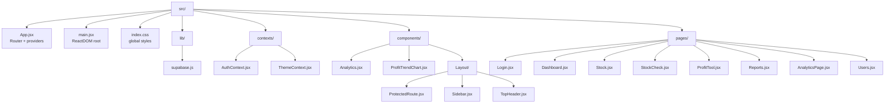
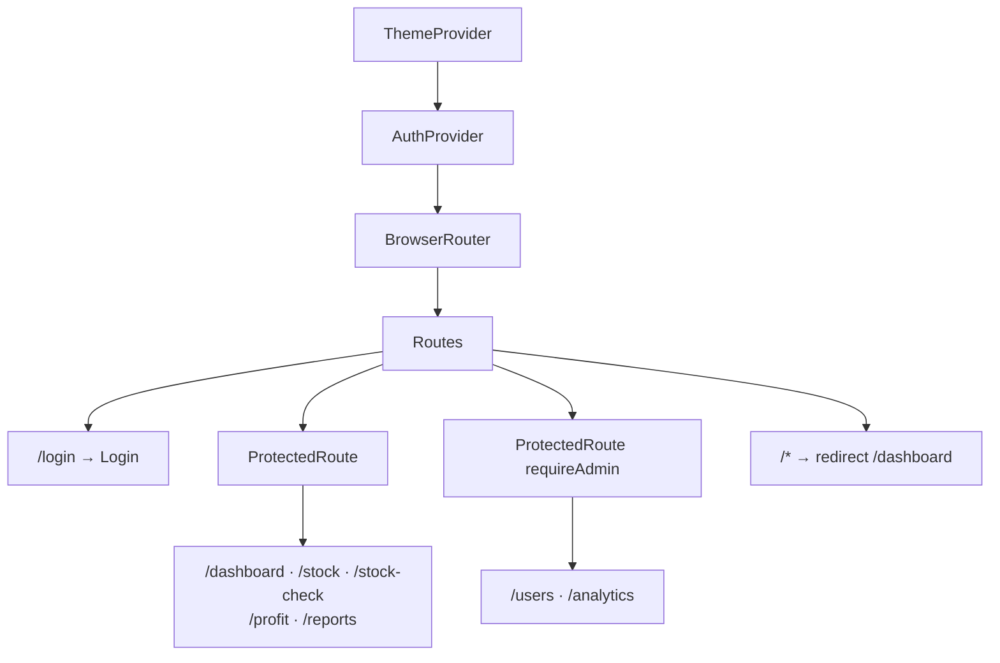
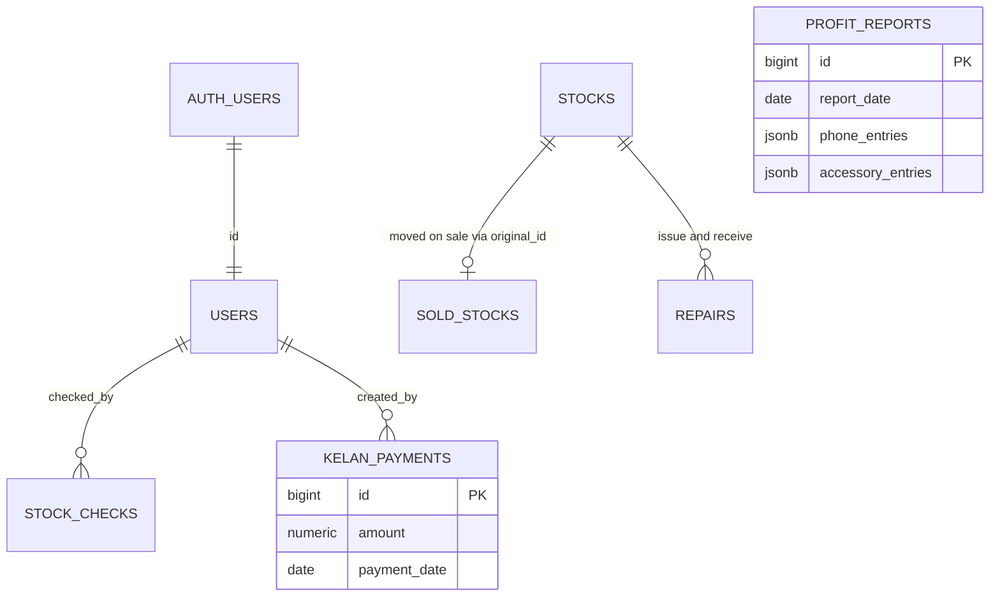
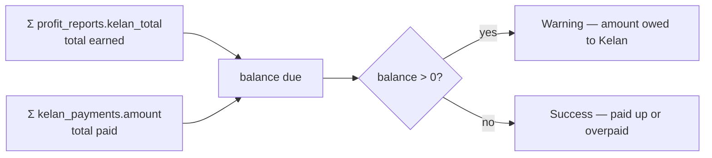
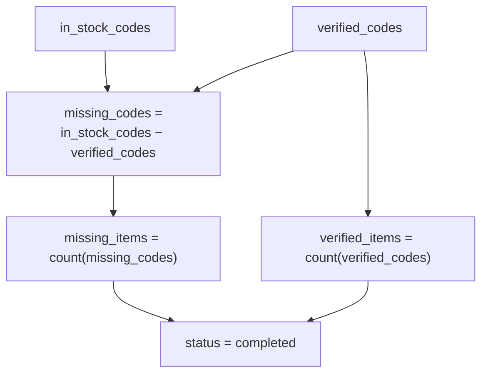
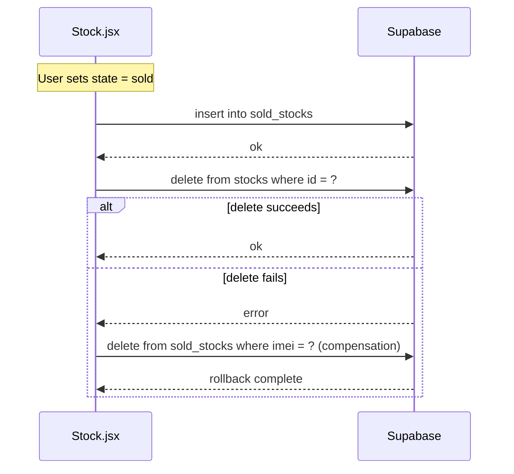

# Low‑Level Design (LLD)

**Project:** Teddy Mobile — Stock Management System
**Version:** 1.0
**Last updated:** 2026‑05‑19

This document complements the [HLD](./HLD.md) by describing the internal structure of the front‑end code, the database schema, key algorithms, edge cases, and error handling.

---

## 1. Source Layout



### Composition (App.jsx)



---

## 2. Core Modules — Responsibilities & Interfaces

### 2.1 `lib/supabase.js`
Singleton Supabase client. Reads `VITE_SUPABASE_URL` and `VITE_SUPABASE_ANON_KEY` from `import.meta.env`. Logs an error if either is missing.

```js
export const supabase = createClient(url, anonKey)
```

### 2.2 `contexts/AuthContext.jsx`

| Member          | Type                                       | Notes                                       |
| --------------- | ------------------------------------------ | ------------------------------------------- |
| `user`          | `Session.user \| null`                     | Set from `supabase.auth.getSession()`.      |
| `userProfile`   | `{ id, role, ... } \| null`                | Row from `public.users`.                    |
| `loading`       | `boolean`                                  | True until first session check completes.   |
| `signIn(email,password)` | `Promise<AuthResponse>`             | Wraps `signInWithPassword`.                 |
| `signOut()`     | `Promise<void>`                            | Clears local state.                         |
| `isAdmin()`     | `() => boolean`                            | `userProfile?.role === 'admin'`.            |

Behaviour:
- Subscribes to `supabase.auth.onAuthStateChange` and refreshes the profile.
- If no row exists in `users` for the authenticated id, defaults role to `cashier` in memory only.

### 2.3 `components/Layout/ProtectedRoute.jsx`
- If `loading` → renders a spinner.
- If `!user` → `<Navigate to="/login" state={{ from: location }} replace />`.
- If `requireAdmin && !isAdmin()` → redirect to `/dashboard`.
- Otherwise renders `<TopHeader/>`, `<Sidebar/>`, and `<Outlet/>` inside `.main-content`.
- Sidebar default open state derived from `window.innerWidth >= 1024`; collapses on resize below 1024 px.

### 2.4 `pages/Stock.jsx`
Single page with three tabs: **Stock**, **Sold**, **Repairs**.

- `fetchStocks()` queries `stocks` or `sold_stocks` based on the active tab, ordered by `created_at` / `sell_date` desc.
- `fetchRepairs()` queries `repairs` ordered by `issue_date` desc.
- Generates a stock code via `TDY-${imei.slice(-4)}` when adding new inventory.
- Sell flow: insert into `sold_stocks` then delete from `stocks`. On failure of the delete, attempts a compensating delete from `sold_stocks` (by IMEI).
- "Move back to in stock" flow inverts the above.
- Repair flow: `repairs` table holds full snapshot of the device while it is out.
- Only admins can hard‑delete (UI guard + future RLS).

### 2.5 `pages/StockCheck.jsx`
- A session is a row in `stock_checks` with `status in ('in_progress','completed')`.
- `verified_codes` and `missing_codes` are stored as JSON arrays on the row.
- Verifying a code appends it to `verified_codes` and increments `verified_items`.
- Completing the session computes `missing_codes` as in‑stock codes not in `verified_codes`.
- Exports an audit PDF via jsPDF + autotable.

### 2.6 `pages/ProfitTool.jsx`
Container with two sub‑sections: **Profit Calculations** and **Kelan Payments**.

- **Profit Calculations** state:
  - `phoneData[]`, `accessoryData[]` — each entry derives
    `profit = revenue − cost`, `thabrew = 0.8 × profit`, `kelan = 0.2 × profit`.
  - `manualThabrew[]`, `manualKelan[]` — direct entries summed into totals.
- Save flow:
  - Builds `reportData` with all per‑category totals plus the raw entry arrays in JSONB columns.
  - `insert` (or `update` if `isEditMode`) on `profit_reports`.
  - For every phone entry, locates the source row in `stocks` (by `tdyCode`, fall back to `imei`), inserts into `sold_stocks`, deletes from `stocks`.
- PDF: Uses `doc.autoTable` to lay out four sections (Phones, Accessories, Thabrew, Kelan).
- **Kelan Payments**:
  - `totalEarned = Σ profit_reports.kelan_total`
  - `totalPaid   = Σ kelan_payments.amount`
  - Balance shown in the UI; "Add payment" inserts a row in `kelan_payments`.

### 2.7 `pages/Reports.jsx`
- Lists rows from `profit_reports`, supports date filtering.
- Per‑report PDF re‑generation (admin can also delete).

### 2.8 `pages/AnalyticsPage.jsx` & `components/Analytics.jsx`
- Pulls last N rows from `profit_reports`, aggregates by weekday for "best selling days", computes phone‑vs‑accessory revenue ratios, and renders progress to the monthly goal.

### 2.9 `pages/Dashboard.jsx`
- Computes:
  - `inStock = stocks.filter(s => s.state === 'in_stock').length`
  - `kelanBalance = Σ kelan_total − Σ kelan_payments.amount`
- Two clickable stat cards plus, for admins, the `ProfitTrendChart`.

### 2.10 `pages/Users.jsx`
- Admin‑only CRUD over `public.users`.

---

## 3. Database Schema (Supabase Postgres)

> The DDL below reflects how the application uses each table. Types are pragmatic suggestions; tune to your environment.

### 3.1 `users`
```sql
create table public.users (
  id         uuid primary key references auth.users (id) on delete cascade,
  email      text unique not null,
  full_name  text,
  role       text not null default 'cashier' check (role in ('admin','cashier')),
  created_at timestamptz not null default now()
);
```

### 3.2 `stocks`
```sql
create table public.stocks (
  id              bigserial primary key,
  code            text unique not null,             -- 'TDY-XXXX'
  phone           text not null,
  imei            text unique not null,
  storage         text,
  colour          text,
  description     text,
  buy_date        date not null,
  cost            numeric(12,2) not null default 0,
  wholesale_price numeric(12,2),
  retail_price    numeric(12,2),
  state           text not null default 'in_stock' check (state in ('in_stock','sold')),
  return_date     date,
  created_at      timestamptz not null default now()
);

create index stocks_state_idx on public.stocks (state);
create index stocks_imei_idx  on public.stocks (imei);
```

### 3.3 `sold_stocks`
```sql
create table public.sold_stocks (
  id           bigserial primary key,
  original_id  bigint,
  code         text not null,
  phone        text not null,
  imei         text not null,
  storage      text,
  colour       text,
  description  text,
  buy_date     date,
  cost         numeric(12,2) not null default 0,
  sell_price   numeric(12,2) not null default 0,
  sell_date    date not null,
  created_at   timestamptz not null default now()
);

create index sold_stocks_sell_date_idx on public.sold_stocks (sell_date desc);
create index sold_stocks_imei_idx      on public.sold_stocks (imei);
```

### 3.4 `repairs`
```sql
create table public.repairs (
  id                   bigserial primary key,
  code                 text not null,
  phone                text not null,
  imei                 text not null,
  colour               text,
  storage              text,
  description          text,
  buy_date             date,
  cost                 numeric(12,2),
  wholesale_price      numeric(12,2),
  retail_price         numeric(12,2),
  issue_date           date not null default current_date,
  repair_description   text,
  person               text,
  created_at           timestamptz not null default now()
);
```

### 3.5 `stock_checks`
```sql
create table public.stock_checks (
  id              bigserial primary key,
  check_date      date not null,
  checked_by      uuid references auth.users(id),
  total_items     int  not null default 0,
  verified_items  int  not null default 0,
  missing_items   int  not null default 0,
  verified_codes  jsonb not null default '[]'::jsonb,
  missing_codes   jsonb not null default '[]'::jsonb,
  status          text not null default 'in_progress' check (status in ('in_progress','completed')),
  created_at      timestamptz not null default now()
);
```

### 3.6 `profit_reports`
```sql
create table public.profit_reports (
  id                          bigserial primary key,
  report_date                 date not null,
  phone_total_revenue         numeric(14,2) not null default 0,
  phone_total_cost            numeric(14,2) not null default 0,
  phone_total_profit          numeric(14,2) not null default 0,
  accessory_total_revenue     numeric(14,2) not null default 0,
  accessory_total_cost        numeric(14,2) not null default 0,
  accessory_total_profit      numeric(14,2) not null default 0,
  thabrew_phone_profit        numeric(14,2) not null default 0,
  thabrew_accessory_profit    numeric(14,2) not null default 0,
  thabrew_total               numeric(14,2) not null default 0,
  kelan_phone_profit          numeric(14,2) not null default 0,
  kelan_accessory_profit      numeric(14,2) not null default 0,
  kelan_total                 numeric(14,2) not null default 0,
  phone_entries               jsonb not null default '[]'::jsonb,
  accessory_entries           jsonb not null default '[]'::jsonb,
  thabrew_entries             jsonb not null default '[]'::jsonb,
  kelan_entries               jsonb not null default '[]'::jsonb,
  created_at                  timestamptz not null default now()
);

create index profit_reports_date_idx on public.profit_reports (report_date desc);
```

### 3.7 `kelan_payments`
```sql
create table public.kelan_payments (
  id           bigserial primary key,
  payment_date date not null,
  amount       numeric(12,2) not null,
  note         text,
  created_by   uuid references auth.users(id),
  created_at   timestamptz not null default now()
);

create index kelan_payments_date_idx on public.kelan_payments (payment_date desc);
```

### 3.8 ER Diagram (conceptual)



---

## 4. Key Algorithms

### 4.1 Stock Code Derivation
```js
const generateStockCode = (imei) => `TDY-${imei.slice(-4)}`
```
Constraints: caller must validate IMEI length ≥ 4 and uniqueness of the resulting code in `stocks`.

### 4.2 Profit Split
```js
const profit  = revenue - cost
const thabrew = profit * 0.8
const kelan   = profit * 0.2
```
- Negative profits are allowed (returns, write‑downs) and flow through to the split.
- All arithmetic is JavaScript `number`; persisted as `numeric(14,2)` server‑side.

### 4.3 Kelan Balance


- A positive balance means we owe Kelan; surfaced in warning color on the dashboard.
- A zero or negative balance is surfaced in success color.

### 4.4 Stock Check Completion



---

## 5. Sell Flow — Sequence



> **Known limitation:** these two operations are not in a database transaction. For atomicity, encapsulate them in a Supabase **RPC function** (PL/pgSQL) and call it from the client.

---

## 6. Error Handling Conventions

| Layer            | Strategy                                                                 |
| ---------------- | ------------------------------------------------------------------------ |
| Supabase calls   | `try / catch`; show user‑visible message via `setMessage({type:'error'})` or `alert()`. |
| Auth profile     | Missing profile row → fall back to `cashier`; never throw to the UI.     |
| Form validation  | Inline state + disabled submit while `saving`.                           |
| PDF generation   | Pure client; failures are caught and logged.                             |

---

## 7. State Management

- No global store (Redux/Zustand). Two React Contexts:
  - `AuthContext` — session/profile/role.
  - `ThemeContext` — light/dark preference.
- Page‑level state lives in `useState`/`useEffect` inside each page. Lists are fetched on mount and re‑fetched after mutations.
- `useLocation().state` is used to deep‑link into specific tabs (e.g. Dashboard → Profit Tool → Kelan Payments).

---

## 8. Styling

- Single `src/index.css` exposes design tokens:
  - Colors: `--primary`, `--primary-light`, `--bg`, `--bg-secondary`, `--text`, `--success`, `--warning`, `--danger`.
  - Layout: `--sidebar-width`, `--header-height`, spacing scale.
- Dark mode toggles a class on `<html>` (driven by `ThemeContext`), swapping the variable set.
- Component utility classes (`.card`, `.btn`, `.btn-outline`, `.tabs`, `.stat-card`, `.stats-grid`, `.page-shell`, etc.) keep markup terse.

---

## 9. Edge Cases & Validations

- **IMEI < 4 digits:** stock code generator should reject (currently relies on UI).
- **Duplicate IMEI/code:** enforced by `unique` constraints in `stocks`.
- **Profit report referencing a phone already sold:** lookup returns no row; the entry is **skipped** (not failed) so the report can still save.
- **Concurrent stock check sessions:** the UI assumes at most one row with `status = 'in_progress'`; add a partial unique index to enforce.
- **Browser refresh during a Profit Tool draft:** local state is **not** persisted; users should save frequently. Future: localStorage draft cache.
- **Anon key abuse:** RLS policies are mandatory in production (see HLD §7).

---

## 10. Testing Strategy (planned)

| Level       | Tooling                | Target coverage                                       |
| ----------- | ---------------------- | ----------------------------------------------------- |
| Unit        | Vitest + Testing Library | Pure helpers (code generator, profit split, balance) |
| Component   | Vitest + Testing Library | Forms, modals, table sorting                         |
| E2E         | Playwright              | Login, add stock, sell, save report, audit flow      |
| DB / RLS    | pgTAP or Supabase tests | Each policy per table & role                          |

---

## 11. Configuration Matrix

| Env Var                  | Where used         | Notes                                  |
| ------------------------ | ------------------ | -------------------------------------- |
| `VITE_SUPABASE_URL`      | `lib/supabase.js`  | Required at build & runtime.           |
| `VITE_SUPABASE_ANON_KEY` | `lib/supabase.js`  | Required at build & runtime.           |

Vercel: set both in **Project → Settings → Environment Variables** for Production, Preview, and Development.

---

## 12. Open Improvements (Engineering Backlog)

1. Move `stocks ↔ sold_stocks` transitions into a single Supabase RPC for atomicity.
2. Enable & version‑control RLS policies (SQL migrations).
3. Add `audit_log` table written via a trigger on every mutating action.
4. Extract pages > 1k LoC (`Stock.jsx`, `ProfitTool.jsx`) into smaller files.
5. Introduce TypeScript progressively starting from `lib/` and `contexts/`.
6. Set up ESLint + Prettier as a pre‑commit hook.
7. Add Vitest + Playwright pipelines in GitHub Actions.
